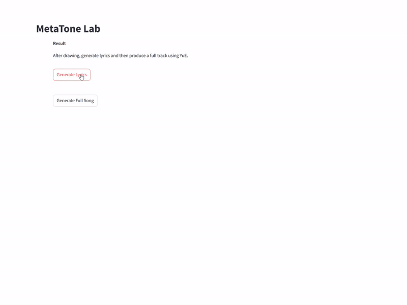

# MetaTone Lab
> **MetaTone Lab** — an interactive generative-AI app that turns freehand sketches into poetic song lyrics and full audio tracks.


## Link to project video recording: https://artslondon-my.sharepoint.com/:v:/g/personal/x_xiang0220241_arts_ac_uk/ESZ-YUZ9VIJIhMMBlMmSBGYBtRtMArcEjBtgmW2WdZXiQw

## 📸 Demo & Screenshots

Below are three silent GIFs showcasing the full workflow:

1. **Sketch Canvas**  
     
   *Sketch Canvas*: Freehand drawing on the canvas

2. **Lyrics Generation**  
     
   *Lyrics Generation*: Auto-generated, structured song lyrics

3. **Audio Synthesis**  
     
   *Audio Synthesis*: Plays the final track after clicking “Generate complete song”


# Setup instructions:

## Project Setup Instructions

This project mainly depends on two major components:

- **YuE for Windows** (for vocal synthesis functionality)
- **Local Streamlit project** (including lyrics generation + visualization interface)

To successfully run this project on Windows, ensure that `conda` or `Anaconda` is installed, and use a `conda` environment in the following steps.

---

## Directory Structure Example

You can place this project (`AI-4-Media-Project-XiaoxinXiang`) and `YuE-for-windows` in the same directory level:

```lua
├─AI-4-Media-Project-XiaoxinXiang  <-- Project code goes here
└─YuE-for-windows  <-- YuE code goes here
```

---

## 1. Clone or Download This Project

Run the following command in the target directory:

```bash
git clone <your_project_repo_url> AI-4-Media-Project-XiaoxinXiang
```

Alternatively, download the zip file and extract it to `AI-4-Media-Project-XiaoxinXiang`.

---

## 2. Create and Activate Conda Environment

The project `app.py` requires Python 3.10.

```bash
# Create a new environment named metatone with Python 3.10
conda create -n metatone python=3.10

# Activate the environment
conda activate metatone
```

---

## 3. Create and Activate YuE-for-Windows Environment

YuE requires an additional Python environment. It is recommended to create a separate `conda` environment inside `YuE-for-windows`.

```bash
# Create an environment named yue with Python 3.8
conda create -n yue python=3.8

# Activate the environment
conda activate yue

# Install YuE dependencies
pip install -r requirements.txt
```

---

## 4. Install FlashAttention2 (Optional but Highly Recommended)

YuE requires `FlashAttention 2` for long audio generation. Before installation, ensure your CUDA version is correct.

Example:

```bash
# Install Pytorch/CUDA (Ensure CUDA >= 11.8)
conda install pytorch torchvision torchaudio cudatoolkit=11.8 -c pytorch -c nvidia

# Install FlashAttention 2
pip install flash-attn --no-build-isolation
```

If installation errors occur, refer to the official `flash-attn` documentation to match your system's CUDA version.

---

## 5. Download and Configure YuE-for-Windows

Clone the `YuE-for-windows` repository:

```bash
git clone https://github.com/sdbds/YuE-for-windows.git
cd YuE-for-windows
```

If using Git LFS, install and enable it first:

```bash
# Windows does not require sudo, so it can be omitted.
git lfs install
```

---

## 6. Install Project Dependencies

Switch back to the project directory and install the required Python packages:

```bash
cd ../AI-4-Media-Project-XiaoxinXiang
pip install -r requirements.txt
```

---

## 7. Launch the Project

Navigate to `AI-4-Media-Project-XiaoxinXiang` in the terminal and start `Streamlit`:

```bash
Streamlit run app.py
```

Where `app.py` is the entry script containing the following code:

```python
import streamlit as st

st.set_page_config(page_title="MetaTone Lab", layout="wide")
# ... Other code display ...
```

Once successfully running, a URL like `http://localhost:8501` will appear, which can be opened in a web browser.

---
